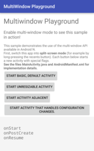
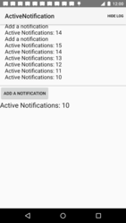

# Android 7.0示例
使用下面的代码示例了解Android 7.0的功能和API。 要在Android Studio中下载示例，请选择**File > New > Import Samples**菜单选项。

> **注意**：这些可下载的项目被设计与Gradle和Android Studio结合使用。

### Multi-Window Playground

此示例演示如何在您的应用程序中利用多窗口用户界面。

[从GitHub上获取](https://github.com/googlesamples/android-MultiWindowPlayground)

### Active Notifications

这是一个之前已存在的示例，展示一个使用NotificationCompat发送通知的简单服务。每个来自用户的未读会话都作为不同的通知发送。

此示例已更新，以利用Android 7.0（API级别24）中提供的新通知功能。

[从GitHub上获取](https://github.com/googlesamples/android-ActiveNotifications)

### Messaging Service

这是一个之前已存在的示例，演示如何使用NotificationManager来获取一个应用程序当前显示的通知数。

此示例已更新，以利用Android 7.0（API级别24）中提供的新通知功能。

[从GitHub上获取](https://github.com/googlesamples/android-MessagingService)

### Direct Boot

此示例演示如何在设备加密存储区（设备启动时始终可用）存储和访问数据。

[从GitHub上获取](https://github.com/googlesamples/android-DirectBoot)

### Scoped Directory Access

此示例演示如何从特定目录读取和写入数据，同时需要较少的权限。

[从GitHub上获取](https://github.com/googlesamples/android-ScopedDirectoryAccess)

