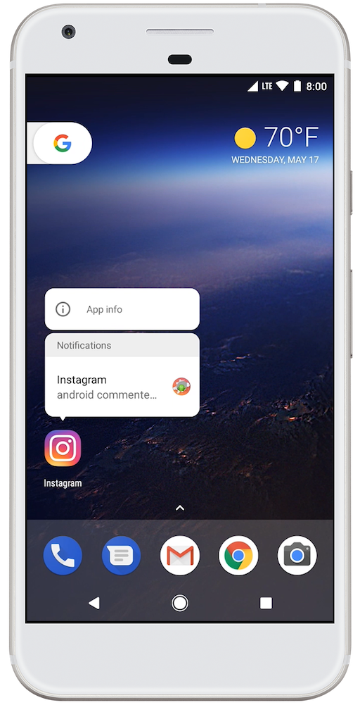

# Android 8.0功能和APIs
Android 8.0为用户和开发者引入多种新功能。本文重点介绍面向开发者的新功能。

请务必查阅[Android 8.0行为变更](android-8.0-changes.html)以了解平台变更可能影响您的应用的领域。

### 用户体验
#### <a id="notifications"></a>通知
在Android 8.0中，我们已重新设计通知，以便为管理通知行为和设置提供更轻松和更统一的方式。这些变更包括：
* 通知渠道：Android 8.0引入了通知渠道，其允许您为要显示的每种通知类型创建用户可自定义的渠道。用户界面将通知渠道称之为通知类别。要了解如何实现通知渠道的信息，请参阅[通知渠道](https://developer.android.google.cn/guide/topics/ui/notifiers/notifications.html#ManageChannels)指南。
* 通知标志：Android 8.0引入了对在应用启动器图标上显示通知标志的支持。通知标志可反映某个应用是否存在与其关联、并且用户尚未予以清除也未对其采取行动的通知。通知标志也称为通知点。要了解如何调整通知标志，请参阅[通知标志](https://developer.android.google.cn/guide/topics/ui/notifiers/notifications.html#Badges)指南。
* 休眠：用户可以将通知置于休眠状态，以便稍后重新显示它。重新显示时通知的重要程度与首次显示时相同。应用可以移除或更新已休眠的通知，但更新休眠的通知并不会使其重新显示。
* 通知超时：现在，使用[setTimeoutAfter()](https://developer.android.google.cn/reference/android/app/Notification.Builder.html#setTimeoutAfter&#40;long&#41;)创建通知时您可以设置超时。您可以使用此方法指定一个持续时间，过了该持续时间后取消通知。如果需要，您可以在指定的超时持续时间之前取消通知。
* 通知设置：当您使用[Notification.INTENT_CATEGORY_NOTIFICATION_PREFERENCES](https://developer.android.google.cn/reference/android/app/Notification.html#INTENT_CATEGORY_NOTIFICATION_PREFERENCES) Intent从通知创建指向应用通知设置的链接时，您可以调用`setSettingsText()`来设置要显示的文本。此系统可以提供以下Extra数据和Intent，用于过滤应用必须向用户显示的设置：`EXTRA_CHANNEL_ID`、`NOTIFICATION_TAG`和`NOTIFICATION_ID`。
* 通知清除：系统现在可区分通知是由用户清除，还是由应用移除。要查看清除通知的方式，您应实现[NotificationListenerService](https://developer.android.google.cn/reference/android/service/notification/NotificationListenerService.html)类的新[onNotificationRemoved()](https://developer.android.google.cn/reference/android/service/notification/NotificationListenerService.html#onNotificationRemoved&#40;android.service.notification.StatusBarNotification, android.service.notification.NotificationListenerService.RankingMap, int&#41;)方法。
* 背景颜色：您现在可以设置和启用通知的背景颜色。只能在用户必须一眼就能看到的持续任务的通知中使用此功能。例如，您可以为与驾车路线或正在进行的通话有关的通知设置背景颜色。您还可以使用[Notification.Builder.setColor()](https://developer.android.google.cn/reference/android/app/Notification.Builder.html#setColor&#40;int&#41;)设置所需的背景颜色。这样做将允许您使用[Notification.Builder.setColorized()](https://developer.android.google.cn/reference/android/app/Notification.Builder.html#setColorized&#40;boolean&#41;)启用通知的背景颜色设置。
* 消息样式：现在，使用[MessagingStyle](https://developer.android.google.cn/reference/android/app/Notification.MessagingStyle.html)类的通知可在其折叠形式中显示更多内容。对于与消息有关的通知，您应使用[MessagingStyle](https://developer.android.google.cn/reference/android/app/Notification.MessagingStyle.html)类。您还可以使用新的[addHistoricMessage()](https://developer.android.google.cn/reference/android/app/Notification.MessagingStyle.html#addHistoricMessage&#40;android.app.Notification.MessagingStyle.Message&#41;)方法，通过向与消息相关的通知添加历史消息为会话提供上下文。



**图 1.** 用户可以长按应用启动器图标以查看Android 8.0中的通知。

#### 自动填充框架
帐号创建、登录和信用卡交易需要时间并且容易出错。在使用要求执行此类重复性任务的应用时，用户很容易遭受挫折。

Android 8.0通过引入自动填充框架，简化了登录和信用卡表单之类表单的填写工作。在用户选择接受自动填充之后，新老应用都可使用自动填充框架。

您可以采取某些措施，优化您的应用使用此框架的方式。如需了解详细信息，请参阅[自动填充框架概览](https://developer.android.google.cn/guide/topics/text/autofill.html)。

#### 画中画模式
Android 8.0允许以画中画(PIP)模式启动Activity。PIP是一种特殊的多窗口模式，最常用于视频播放。目前，PIP模式可用于Android TV，而Android 8.0则让该功能可进一步用于其他Android设备。

当某个 Activity 处于 PIP 模式时，它会处于暂停状态，但仍应继续显示内容。因此，您应确保您的应用在[onPause()](https://developer.android.google.cn/reference/android/app/Activity.html#onPause&#40;&#41;)处理程序中进行处理时不会暂停播放。相反，您应在[onStop()](https://developer.android.google.cn/reference/android/app/Activity.html#onStop&#40;&#41;)中暂停播放视频，并在[onStart()](https://developer.android.google.cn/reference/android/app/Activity.html#onStart&#40;&#41;)中继续播放。如需了解详细信息，请参阅多窗口生命周期。

要指定您的Activity可以使用PIP模式，请在清单中将`android:supportsPictureInPicture`设置为true。（从Android 8.0开始，如果您打算在 Android TV或其他Android设备上支持PIP模式，则无需将`android:resizeableActivity`设置为true；只有在您的Activity支持其他多窗口模式时，才需要设置`android:resizeableActivity。`）

##### API变更
Android 8.0引入一种新的对象[android.app.PictureInPictureParams](https://developer.android.google.cn/reference/android/app/PictureInPictureParams.html)，您可以将该对象传递给PIP方法来指定某个Activity在其处于PIP模式时的行为。此对象还指定了各种属性，例如Activity的首选纵横比。

现在，在[添加画中画](https://developer.android.google.cn/training/tv/playback/picture-in-picture.html)中介绍的现有PIP方法可用于所有Android设备，而不仅限于Android TV。此外，Android 8.0还提供以下方法来支持PIP模式：

* [Activity.enterPictureInPictureMode(PictureInPictureParams args)](https://developer.android.google.cn/reference/android/app/Activity.html#enterPictureInPictureMode&#40;android.app.PictureInPictureParams&#41;)：将Activity置于画中画模式。Activity的纵横比和其他配置设置均由`args`指定。如果`args`中的任何字段为空，系统将使用您上次调用[Activity.setPictureInPictureParams()](https://developer.android.google.cn/reference/android/app/Activity.html#setPictureInPictureParams&#40;android.app.PictureInPictureParams&#41;)时所设置的值。
指定的Activity被置于屏幕的一角，屏幕剩余部分则被屏幕之前显示的上一Activity所填满。进入PIP模式的Activity将进入暂停状态，但仍保持已启动状态。如果用户点按此PIP Activity，系统将显示一个菜单供用户操作，而在Activity处于PIP状态期间，不会理会任何触摸事件。
* [Activity.setPictureInPictureParams()](https://developer.android.google.cn/reference/android/app/Activity.html#setPictureInPictureParams&#40;android.app.PictureInPictureParams&#41;)更新Activity的PIP配置设置。如果Activity目前处于PIP模式，则会更新此设置；如果 Activity的纵横比发生变化，这非常有用。如果Activity不处于PIP模式，则会使用这些配置设置，而不会考虑您调用的`enterPictureInPictureMode()`方法。

#### 可下载字体
Android 8.0和Android支持库26允许您从提供程序应用请求字体，而无需将字体绑定到APK中或让APK下载字体。此功能可减小APK大小，提高应用安装成功率，使多个应用可以共享同一种字体。

如需了解有关下载字体的详细信息，请参阅[可下载字体](https://developer.android.google.cn/guide/topics/ui/look-and-feel/downloadable-fonts.html)。

#### XML中的字体
Android 8.0推出一项新功能，即XML中的字体，允许您使用字体作为资源。这意味着，不再需要以资产的形式捆绑字体。字体在`R`文件中编译，并且作为一种资源，可自动用于系统。然后，您可以利用一种新的资源类型`font`来访问这些字体。

在运行API版本14及更高版本的设备中，支持库26对此功能提供完全支持。

如需了解有关以资源形式使用字体以及检索系统字体有关的详细信息，请参阅[XML中的字体](https://developer.android.google.cn/guide/topics/ui/look-and-feel/fonts-in-xml.html)。

#### 自动调整TextView的大小
Android 8.0允许您根据TextView的大小自动设置文本展开或收缩的大小。这意味着，在不同屏幕上优化文本大小或者优化包含动态内容的文本大小比以往简单多了。如需了解有关如何在Android 8.0中自动调整TextView的大小的详细信息，请参阅[自动调整TextView的大小](https://developer.android.google.cn/guide/topics/ui/look-and-feel/autosizing-textview.html)。

#### 自适应图标
Android 8.0引入自适应启动器图标。自适应图标支持视觉效果，可在不同设备型号上显示为各种不同的形状。要了解如何创建自适应图标，请参阅[自适应图标](https://developer.android.google.cn/guide/practices/ui_guidelines/icon_design_adaptive.html)预览功能指南。

#### 颜色管理
图像应用的Android开发者现在可以利用支持广色域彩色显示的新设备。要显示广色域图像，应用需要在其清单（每个Activity）中启用一个标志，并加载具有嵌入的广域彩色配置文件（AdobeRGB、Pro Photo RGB、DCI-P3 等）的位图。

#### WebView API
Android 8.0提供多种API，帮助您管理在应用中显示网页内容的[WebView](https://developer.android.google.cn/reference/android/webkit/WebView.html)对象。这些API可增强应用的稳定性和安全性，它们包括：
* Version API
* Google SafeBrowsing API
* Termination Handle API
* Renderer Importance API
如需了解有关这些API用法的更多信息，请参阅[管理WebView](https://developer.android.google.cn/guide/webapps/managing-webview.html)。

#### 固定快捷方式和小部件
Android 8.0引入了快捷方式和小部件的应用内固定功能。在您的应用中，您可以根据用户权限为支持的启动器创建固定的快捷方式和小部件。

如需了解详细信息，请参阅[固定快捷方式和小部件](https://developer.android.google.cn/guide/topics/ui/shortcuts.html)预览功能指南。

#### 最大屏幕纵横比
以Android 7.1（API级别25）或更低版本为目标平台的应用默认的最大屏幕纵横比为1.86。针对 Android 8.0 或更高版本的应用没有默认的最大纵横比。如果您的应用需要设置最大纵横比，请使用定义您的操作组件的清单文件中的[maxAspectRatio](https://developer.android.google.cn/reference/android/R.attr.html#maxAspectRatio)属性。

#### 多显示器支持
从Android 8.0开始，此平台为多显示器提供增强的支持。如果Activity支持多窗口模式，并且在具有多显示器的设备上运行，则用户可以将Activity从一个显示器移动到另一个显示器。当应用启动Activity时，此应用可指定Activity应在哪个显示器上运行。

> 注：如果Activity支持多窗口模式，则Android 8.0将为该Activity自动启用多显示器支持。您应测试您的应用，确保它在多显示器环境下可正常运行。

每次只有一个Activity可以处于继续状态，即使此应用具有多个显示器。具有焦点的Activity将处于继续状态，所有其他可见的Activity均暂停，但不会停止。如需了解有关当多个Activity可见时活动生命周期的详细信息，请参阅[多窗口生命周期](https://developer.android.google.cn/guide/topics/ui/multi-window.html#lifecycle)。

当用户将 Activity 从一个显示器移动到另一个显示器时，系统将调整 Activity 大小，并根据需要发起运行时变更。您的 Activity 可以自行处理配置变更，或允许系统销毁包含该 Activity 的进程，并以新的尺寸重新创建它。如需了解详细信息，请参[阅处理配置变更](https://developer.android.google.cn/guide/topics/resources/runtime-changes.html)。

[ActivityOptions](https://developer.android.google.cn/reference/android/app/ActivityOptions.html)提供两个新函数以支持多个显示器：

[setLaunchDisplayId()](https://developer.android.google.cn/reference/android/app/ActivityOptions.html#setLaunchDisplayId&#40;int&#41;)

    指定Activity在启动后应显示在哪个显示器上。

[getLaunchDisplayId()](https://developer.android.google.cn/reference/android/app/ActivityOptions.html#getLaunchDisplayId&#40;&341;)

    返回操作组件的当前启动显示器。

对adb shell进行了扩展，以支持多个显示器。shell start命令现在可用于启动操作组件，并指定操作组件的目标显示器：
```shell
adb shell start <activity_name> --display <display_id>
```

#### 统一的布局外边距和内边距
Android 8.0让您可以更轻松地指定[View](https://developer.android.google.cn/reference/android/view/View.html)元素的对边使用相同外边距和内边距的情形。具体来说，您现在可以在布局XML文件中使用以下属性：
* [layout_marginVertical](https://developer.android.google.cn/reference/android/R.attr.html#layout_marginVertical)，同时定义[layout_marginTop](https://developer.android.google.cn/reference/android/R.attr.html#layout_marginTop)和[layout_marginBottom](https://developer.android.google.cn/reference/android/R.attr.html#layout_marginBottom)。
* [layout_marginHorizontal](https://developer.android.google.cn/reference/android/R.attr.html#layout_marginHorizontal)，同时定义[layout_marginLeft](https://developer.android.google.cn/reference/android/R.attr.html#layout_marginLeft)和[layout_marginRight](https://developer.android.google.cn/reference/android/R.attr.html#layout_marginRight)。
* [paddingVertical](https://developer.android.google.cn/reference/android/R.attr.html#paddingVertical)，同时定义[paddingTop](https://developer.android.google.cn/reference/android/R.attr.html#paddingTop)和[paddingBottom](https://developer.android.google.cn/reference/android/R.attr.html#paddingBottom)。
* [paddingHorizontal](https://developer.android.google.cn/reference/android/R.attr.html#paddingHorizontal)，同时定义[paddingLeft](https://developer.android.google.cn/reference/android/R.attr.html#paddingLeft)和[paddingRight](https://developer.android.google.cn/reference/android/R.attr.html#paddingRight)。

> 注：如果您自定义应用逻辑以[支持不同语言和文化](https://developer.android.google.cn/training/basics/supporting-devices/languages.html)（包括文本方向），请记住，这些属性不会影响[layout_marginStart](https://developer.android.google.cn/reference/android/R.attr.html#layout_marginStart)、[layout_marginEnd](https://developer.android.google.cn/reference/android/R.attr.html#layout_marginEnd)、[paddingStart](https://developer.android.google.cn/reference/android/R.attr.html#paddingStart)或[paddingEnd](https://developer.android.google.cn/reference/android/R.attr.html#paddingEnd)的值。您可以自行设置这些值和新的垂直与水平布局属性来创建取决于文本方向的布局行为。

#### 指针捕获
某些应用（例如游戏、远程桌面和虚拟化客户端）将大大受益于鼠标指针控制。指针捕获是Android 8.0中的一项新功能，可以通过将所有鼠标事件传递到您的应用中焦点视图的方式提供此类控制。

从Android 8.0开始，您的应用中的[View](https://developer.android.google.cn/reference/android/view/View.html)可以请求指针捕获并定义一个侦听器来处理捕获的指针事件。鼠标指针在此模式下将隐藏。如果不再需要鼠标信息，该视图可以释放指针捕获。系统也可以在视图丢失焦点时（例如，当用户打开另一个应用时）释放指针捕获。

如需了解有关如何在您的应用中使用此功能的信息，请参阅[指针捕获](https://developer.android.google.cn/training/gestures/movement.html#pointer-capture)。

#### 应用类别
在适当的情况下，Android 8.0允许每个应用声明其所属的类别。这些类别用于将应用呈现给用户的用途或功能类似的应用归类在一起，例如按流量消耗、电池消耗和存储消耗将应用归类。您可以在`<application>`清单标记中设置`android:appCategory`属性，定义应用的类别。

#### Android TV 启动器
Android 8.0添加了一种以内容为中心的全新[Android TV主屏幕体验](https://developer.android.google.cn/training/tv/discovery/home-screen.html)，支持Android TV模拟器和Nexus Player Android 8.0设备映像。新的主屏幕在对应于频道的行中组织视频内容，这些频道在系统上通过应用填充各个节目。应用可以发布多个频道，用户可以配置他们希望在主屏幕上看到哪些频道。Android TV也包含一个Watch Next行，此行根据用户的观看习惯从应用填充节目。应用也可以提供视频预览，这些预览会在用户聚焦到节目时自动播放。用于填充频道和节目的API属于TvProvider API，这些API以Android支持库模块的形式随Android 8.0分发。

#### AnimatorSet
从Android 8.0开始，[AnimatorSet](https://developer.android.google.cn/reference/android/animation/AnimatorSet.html) API现在支持寻道和倒播功能。寻道功能允许您将动画的位置设置为指定的时间点处。如果您的应用包含可撤消的动作的动画，倒播功能会很有用。现在，您不必定义两组独立的动画，而只需反向播放同一组动画。

#### 输入和导航
##### <a id="kbnc"></a>键盘导航键区
如果您的应用中，某个操作组件使用一种复杂的视图层次结构（如图 2 所示），可考虑将多组界面元素组成一个键区，简化键盘导航这些元素的操作。用户可以在Chromebook设备上按Meta+Tab或Search+Tab，在不同键区之间导航。键区的一些范例包括：侧面板、导航栏、主内容区域和可能包含多个子元素的元素。

以一个包含五个导航键区的操作组件为例，用户可以使用键盘导航键区快捷键进行导航。键区按以下布局显示：顶部面板、左侧面板、主内容区域、底部面板和浮动操作按钮。

要将一个[View](https://developer.android.google.cn/reference/android/view/View.html)或[ViewGroup](https://developer.android.google.cn/reference/android/view/ViewGroup.html)元素设置为一个键区，请在元素的布局XML文件中将[android:keyboardNavigationCluster](https://developer.android.google.cn/reference/android/view/View.html#attr_android:keyboardNavigationCluster)属性设置为`true`，或者将`true`传递至应用界面逻辑中的[setKeyboardNavigationCluster()](https://developer.android.google.cn/reference/android/view/View.html#setKeyboardNavigationCluster&#40;boolean&#41;)。
> **注**：键区不能嵌套，不过，非嵌套键区可以显示在层次结构的不同层级。如果您尝试嵌套键区，框架仅会将最顶层的[ViewGroup](https://developer.android.google.cn/reference/android/view/ViewGroup.html)元素视为键区。

在具有触摸屏的设备中，您可以将某个键区指定的[ViewGroup](https://developer.android.google.cn/reference/android/view/ViewGroup.html)对象的`android:touchscreenBlocksFocus`元素设置为`true`，仅允许从键区导航进入和离开此键区。如果您将此配置应用于某个键区，用户将无法使用Tab键或箭头键导航进入或离开此键区，而是必须按键区导航键盘组合键。


**图 2.** 包含5个键区的操作组件

##### 视图默认焦点
在Android 8.0中，您可以指定在（重新）创建的操作组件继续运行并且用户按下键盘导航键（例如Tab键）之后应接收焦点的[View](https://developer.android.google.cn/reference/android/view/View.html)。要应用“设为默认焦点”设置，请在包含界面元素的布局XML文件中将[View](https://developer.android.google.cn/reference/android/view/View.html)元素的[android:focusedByDefault](https://developer.android.google.cn/reference/android/view/View.html#attr_android:focusedByDefault)属性设置为`true`，或者将`true`传递至应用界面逻辑中的[setFocusedByDefault()](https://developer.android.google.cn/reference/android/view/View.html#setFocusedByDefault&#40;boolean&#41;)。

### 系统
#### 新的StrictMode检测程序
Android 8.0添加了三个新的StrictMode检测程序，帮助识别应用可能出现的错误：
* [detectUnbufferedIo()](https://developer.android.google.cn/reference/android/os/StrictMode.ThreadPolicy.Builder.html#detectUnbufferedIo&#40;&#41;)将检测您的应用何时读取或写入未缓冲的数据，这可能极大影响性能。
* [detectContentUriWithoutPermission()](https://developer.android.google.cn/reference/android/os/StrictMode.VmPolicy.Builder.html#detectContentUriWithoutPermission&#40;&#41;)将检测您的应用在其外部启动Activity时何时意外忘记向其他应用授予权限。
* [detectUntaggedSockets()](https://developer.android.google.cn/reference/android/os/StrictMode.VmPolicy.Builder.html#detectUntaggedSockets&#40;&#41;)将检测您的应用何时使用网络流量，而不使用[setThreadStatsTag(int)](https://developer.android.google.cn/reference/android/net/TrafficStats.html#setThreadStatsTag&#40;int&#41;)将流量标记用于调试目的。

#### 缓存数据
Android 8.0优化了缓存数据的导航和行为。现在，每个应用均获得一定的磁盘空间配额，用于存储[getCacheQuotaBytes(UUID)](https://developer.android.google.cn/reference/android/os/storage/StorageManager.html#getCacheQuotaBytes&#40;java.util.UUID&#41;)返回的缓存数据。

当系统需要释放磁盘空间时，将开始从超过配额最多的应用中删除缓存文件。因此，如果将您的缓存数据量始终保持低于配额的水平，则在必须清除系统中的某些文件时，您的缓存文件将能坚持到最后。系统在决定删除您的应用中的哪些缓存文件时，将首先考虑删除最旧的文件（由修改时间决定）。

您还可以针对每个目录启用两种新行为，以控制系统如何释放缓存数据：
* `StorageManager.setCacheBehaviorAtomic()`可用于指示某个目录及其所有内容应作为一个不可分割的整体进行删除。
* [setCacheBehaviorTombstone(File, boolean)](https://developer.android.google.cn/reference/android/os/storage/StorageManager.html#setCacheBehaviorTombstone&#40;java.io.File, boolean&#41;)可用于指示不应删除某个目录内的文件，而应将它们截断到0字节长度，使空文件保持完好。

最后，在需要为大文件分配磁盘空间时，可考虑使用新的[allocateBytes(FileDescriptor, long)](https://developer.android.google.cn/reference/android/os/storage/StorageManager.html#allocateBytes&#40;java.io.FileDescriptor, long&#41;) API，它将自动清除属于其他应用的缓存文件（根据需要），以满足您的请求。在确定设备是否有足够的磁盘空间保存您的新数据时，请调用[getAllocatableBytes(UUID)](https://developer.android.google.cn/reference/android/os/storage/StorageManager.html#getAllocatableBytes&#40;java.util.UUID&#41;)而不要使用[getUsableSpace()](https://developer.android.google.cn/reference/java/io/File.html#getUsableSpace&#40;&#41;)，因为前者会考虑系统要为您清除的任何缓存数据。

#### 内容提供程序分页
我们已更新内容提供程序以支持加载大型数据集，每次加载一页。例如，一个具有大量图像的照片应用可查询要在页面中显示的数据的子集。内容提供程序返回的每个结果页面由一个Cursor对象表示。客户端和提供程序必须实现分页才能利用此功能。

如需了解有关内容提供程序变更的详细信息，请参阅[ContentProvider](https://developer.android.google.cn/reference/android/content/ContentProvider.html)和[ContentProviderClient](https://developer.android.google.cn/reference/android/content/ContentProviderClient.html)。

#### 内容刷新请求
现在，[ContentProvider](https://developer.android.google.cn/reference/android/content/ContentProvider.html)和[ContentResolver](https://developer.android.google.cn/reference/android/content/ContentResolver.html)类均包含`refresh()`函数，这样，客户端可以更轻松地知道所请求的信息是否为最新信息。

您可以扩展[ContentProvider](https://developer.android.google.cn/reference/android/content/ContentProvider.html)以添加自定义的内容刷新逻辑。请务必重写[refresh()](https://developer.android.google.cn/reference/android/content/ContentProvider.html#refresh&#40;android.net.Uri, android.os.Bundle, android.os.CancellationSignal&#41;)函数，以返回`true`，告知提供程序的客户端您已尝试自行刷新数据。

您的客户端应用可通过调用另一个函数（又称[refresh()](https://developer.android.google.cn/reference/android/content/ContentResolver.html#refresh&#40;android.net.Uri, android.os.Bundle, android.os.CancellationSignal&#41;)），显式请求已刷新的内容。在调用此函数时，传入待刷新数据的URI。

> **注**：由于您可能通过网络不断请求数据，您应仅在有明显迹象表明内容确已过时时才从客户端调用[refresh()](https://developer.android.google.cn/reference/android/content/ContentProvider.html#refresh&#40;android.net.Uri, android.os.Bundle, android.os.CancellationSignal&#41;)。执行此类内容刷新最常见的原因是响应滑动刷新手势，该手势显式请求当前界面显示最新内容。

#### <a id="jobscheduler"></a>JobScheduler改进
Android 8.0引入了对[JobScheduler](https://developer.android.google.cn/reference/android/app/job/JobScheduler.html)的多项改进。由于您通常可以使用计划作业替代现在受限的后台服务或隐式广播接收器，这些改进可以让您的应用更轻松地符合新的[后台执行限制](background.html)。

[JobScheduler](https://developer.android.google.cn/reference/android/app/job/JobScheduler.html)的更新包括：
* 您现在可以将工作队列与计划作业关联。要将一个工作项添加到作业的队列中，请调用[JobScheduler.enqueue()](https://developer.android.google.cn/reference/android/app/job/JobScheduler.html#enqueue&#40;android.app.job.JobInfo,%20android.app.job.JobWorkItem&#41;)。当作业运行时，它可以将待定工作从队列中剥离并进行处理。这种功能可以处理之前需要启动后台服务（尤其是实现[IntentService](https://developer.android.google.cn/reference/android/app/IntentService.html)的服务）的许多用例。
* 您现在可以通过调用[JobInfo.Builder.setClipData()](https://developer.android.google.cn/reference/android/app/job/JobInfo.Builder.html#setClipData&#40;android.content.ClipData,%20int&#41;)的方式将[ClipData](https://developer.android.google.cn/reference/android/content/ClipData.html)与作业关联。利用此选项，您可以将URI权限授予与作业关联，类似于这些权限传递到[Context.startService()](https://developer.android.google.cn/reference/android/content/Context.html#startService&#40;android.content.Intent&#41;)的方式。您也可以将URI权限授予用于工作队列上的intent。
* 计划作业现在支持多个新的约束条件：

[JobInfo.isRequireStorageNotLow()](https://developer.android.google.cn/reference/android/app/job/JobInfo.html#isRequireStorageNotLow&#40;&#41);

    如果设备的可用存储空间非常低，作业将不会运行。

[JobInfo.isRequireBatteryNotLow()](https://developer.android.google.cn/reference/android/app/job/JobInfo.html#isRequireBatteryNotLow&#40;&#41);

    如果电池电量等于或低于临界阈值，作业将不会运行；临界阈值是指设备显示**Low battery warning**系统对话框的电量。

[NETWORK_TYPE_METERED](https://developer.android.google.cn/reference/android/app/job/JobInfo.html#NETWORK_TYPE_METERED)

    作业需要一个按流量计费的网络连接，比如大多数移动数据网络数据套餐。

#### 自定义数据存储
Android 8.0 允许您为首选项提供自定义数据存储，如果您的应用将首选项存储在云或本地数据库中，或者如果首选项特定于某个设备，此功能会非常有用。如需了解有关实现数据存储的详细信息，请参阅[自定义数据存储](https://developer.android.google.cn/guide/topics/ui/settings.html#custom-data-store)。

#### findViewById()签名变更
现在，`findViewById()`函数的全部实例均返回`<T extends View> T`，而不是`View`。此变更会带来以下影响：
* 例如，如果`someMethod(View)`和`someMethod(TextView)`均接受调用`findViewById()`的结果，这可能导致现有代码的返回类型不确定。
* 在使用Java 8源语言时，这需要在返回类型不受限制时（例如，`assertNotNull(findViewById(...)).someViewMethod())`显式转换为`View`。
* 重写非最终的`findViewById()`函数（例如，`Activity.findViewById()`将需要更新其返回类型。

### 媒体增强功能
#### VolumeShaper
有一个新的[VolumeShaper](https://developer.android.google.cn/guide/topics/media/volumeshaper.html)类。您可以用它来执行简短的自动音量转换，例如淡入、淡出和交叉淡入淡出。

#### 音频焦点增强功能
音频应用通过请求和舍弃音频焦点的方式在设备上共享音频输出。应用通过启动或停止播放或者闪避音量的方式处理处于聚焦状态的变更。有一个新的`AudioFocusRequest`类。对于此类，应用在处理音频焦点变化时会使用[新功能](https://developer.android.google.cn/guide/topics/media-apps/audio-focus.html)：[自动闪避](https://developer.android.google.cn/guide/topics/media-apps/audio-focus.html#automatic_ducking)和[延迟聚焦](https://developer.android.google.cn/guide/topics/media-apps/audio-focus.html#delayed_focus_gain)。

#### 媒体指标
新的`getMetrics()`方法将返回一个包含配置和性能信息的[PersistableBundle](https://developer.android.google.cn/reference/android/os/PersistableBundle.html)对象，用一个包含属性和值的地图表示。为以下媒体类定义`getMetrics()`方法：
* [MediaPlayer.getMetrics()](https://developer.android.google.cn/reference/android/media/MediaPlayer.html#getMetrics&#40;&#41;)
* [MediaRecorder.getMetrics()](https://developer.android.google.cn/reference/android/media/MediaRecorder.html#getMetrics&#40;&#41;)
* [MediaCodec.getMetrics()](https://developer.android.google.cn/reference/android/media/MediaCodec.html#getMetrics&#40;&#41;)
* [MediaExtractor.getMetrics()](https://developer.android.google.cn/reference/android/media/MediaExtractor.html#getMetrics&#40;&#41;)

为每个实例单独收集指标，并持续到实例的生命周期结束为止。如果没有可用的指标，则此方法将返回null。返回的实际指标取决于类。

#### MediaPlayer
Android 8.0为MediaPlayer类添加了多种新方法。这些方法可以从多个方面增强您的应用处理媒体播放的能力：
* 在[搜索](https://developer.android.google.cn/guide/topics/media/mediaplayer.html#seeking)帧时进行精细控制。
* 播放[受数字版权管理保护的](https://developer.android.google.cn/guide/topics/media/mediaplayer.html#drm)材料的功能。

#### 音频录制器
* 音频录制器现在支持对流式传输有用的MPEG2_TS格式：
  ```java
  mMediaRecorder.setOutputFormat(MediaRecorder.OutputFormat.MPEG_2_TS);
  ```
  请参阅[MediaRecorder.OutputFormat](https://developer.android.google.cn/reference/android/media/MediaRecorder.OutputFormat.html)
* [MediaMuxer](https://developer.android.google.cn/reference/android/media/MediaMuxer.html)现在可以处理任意数量的音频和视频流，而不再仅限于一个音频曲目和/或一个视频曲目。使用[addTrack()](https://developer.android.google.cn/reference/android/media/MediaMuxer.html#addTrack&#40;android.media.MediaFormat&#41;)可混录所需的任意数量的曲目。
* [MediaMuxer](https://developer.android.google.cn/reference/android/media/MediaMuxer.html)还可以添加一个或多个包含用户定义的每帧信息的元数据曲目。元数据的格式由您的应用定义。仅对MP4容器支持元数据曲目。

元数据可以用于离线处理。例如，传感器的陀螺仪信号可以用于执行视频稳定操作。

在添加元数据曲目时，曲目的MIME格式必须以前缀“application/”开头。除了数据不是来源于`MediaCodec`以外，写入元数据的操作与写入视频/音频数据相同。相反，应用将包含相关时间戳的`ByteBuffer`传递给[writeSampleData()](https://developer.android.google.cn/reference/android/media/MediaMuxer.html#writeSampleData&#40;int, java.nio.ByteBuffer, android.media.MediaCodec.BufferInfo&#41;)方法。时间戳必须和视频及音频曲目处于相同的时基。

生成的MP4文件使用ISOBMFF的12.3.3.2部分定义的`TextMetaDataSampleEntry`，指示元数据的MIME格式。在使用[MediaExtractor](https://developer.android.google.cn/reference/android/media/MediaExtractor.html)提取包含元数据曲目的文件时，元数据的MIME格式将提取到[MediaFormat](https://developer.android.google.cn/reference/android/media/MediaFormat.html)中。

#### 音频播放控制
Android 8.0允许您查询和请求设备产生声音的方式。对音频播放的以下控制将让您的服务更轻松地仅在有利的设备条件下产生声音。

##### Google智能助理的新音频使用类型
[AudioAttributes](https://developer.android.google.cn/reference/android/media/AudioAttributes.html)类包含一种新的声音类型，即[USAGE_ASSISTANT](https://developer.android.google.cn/reference/android/media/AudioAttributes.html#USAGE_ASSISTANT)，对应于Google智能助理在设备上的回答。

##### 设备音频播放的变更
如果您希望自己的服务仅在特定的设备音频配置处于活动状态时开始产生声音，您可以使用[AudioManager](https://developer.android.google.cn/reference/android/media/AudioManager.html)类注册一个[AudioManager.AudioPlaybackCallback](https://developer.android.google.cn/reference/android/media/AudioManager.AudioPlaybackCallback.html)实例，后者的[onPlaybackConfigChanged()](https://developer.android.google.cn/reference/android/media/AudioManager.AudioPlaybackCallback.html#onPlaybackConfigChanged(java.util.List<android.media.AudioPlaybackConfiguration>))函数可以帮助您确定当前活动的音频属性集。

##### 显式请求音频焦点
您的服务可以使用[requestAudioFocus()](https://developer.android.google.cn/reference/android/media/AudioManager.html#requestAudioFocus&#40;android.media.AudioFocusRequest&#41;)函数提交一个更精细的设备级音频焦点接收请求。传入一个`AudioFocusRequest`对象，您可以使用`AudioFocusRequest.Builder`创建这个对象。在这个构建类中，您可以指定以下选项：
* 您希望获得的焦点类型，例如`AUDIOFOCUS_GAIN_TRANSIENT`或`AUDIOFOCUS_GAIN_TRANSIENT_MAY_DUCK`。
* 当另一个音频服务获得设备焦点时，您的服务应以更安静的方式继续，还是完全暂停。
* 您的服务能否等待获得焦点，直至设备就绪。

> **注**：构建您的`AudioFocusRequest`实例时，如果您通过调用`setAcceptsDelayedFocusGain()`指示您的服务可以等待产生声音，您也必须调用`setOnAudioFocusChangeListener()`，以便您的服务了解它何时可以开始产生声音。

##### 增强的媒体文件访问功能
[存储访问框架(SAF)](https://developer.android.google.cn/guide/topics/providers/document-provider.html)允许应用显示自定义[DocumentsProvider](https://developer.android.google.cn/reference/android/provider/DocumentsProvider.html)，后者可以为其他应用提供访问数据源中的文件的权限。事实上，文档提供程序甚至可以提供驻留在网络存储区或使用[媒体传输协议(MTP)](https://en.wikipedia.org/wiki/Media_Transfer_Protocol)等协议的文件的访问权限。

但是，访问远程数据源中的大媒体文件面临一些挑战：
* 媒体播放器需要以寻址方式访问来自文档提供程序的文件。当大媒体文件驻留在远程数据源上时，文档提供程序必须事先提取所有数据，并创建快照文件描述符。媒体播放器无法播放没有文件描述符的文件，因此在文档提供程序完成文件下载前，无法开始播放。
* 照片应用等媒体集合管理器必须通过作用域文件夹遍历一系列访问URI才能访问存储在外部SD卡上的媒体。这种访问模式会让媒体上的批量操作（例如移动、复制和删除）变得非常缓慢。
* 媒体集合管理器无法根据文档的URI确定其位置。这就让这些类型的应用难以允许用户选择媒体文件的保存位置。

Android 8.0 通过改进存储访问框架解决了各个挑战。

###### 自定义文档提供程序
从Android 8.0开始，存储访问框架允许[自定义文档提供程序](https://developer.android.google.cn/guide/topics/providers/create-document-provider.html)为驻留在远程数据源中的文件创建可寻址的文件描述符。SAF 可打开文件，获取原生可寻址的文件描述符。然后 SAF 向文档提供程序提交离散字节请求。此功能使文档提供程序可以返回媒体播放器应用请求的准确字节范围，而不必事先缓存整个文件。

要使用此功能，您需要调用新的[StorageManager.openProxyFileDescriptor()](https://developer.android.google.cn/reference/android/os/storage/StorageManager.html#openProxyFileDescriptor&#40;int, android.os.ProxyFileDescriptorCallback, android.os.Handler&#41;)方法。[openProxyFileDescriptor()](https://developer.android.google.cn/reference/android/os/storage/StorageManager.html#openProxyFileDescriptor&#40;int, android.os.ProxyFileDescriptorCallback, android.os.Handler&#41;)方法可接受[ProxyFileDescriptorCallback](https://developer.android.google.cn/reference/android/os/ProxyFileDescriptorCallback.html)对象作为回调。任何时候，当客户端应用对文档提供程序返回的文件描述符执行文件操作时，SAF都会调用回调。

###### 直接文档访问
从Android 8.0开始，您可以使用[getDocumentUri()](https://developer.android.google.cn/reference/android/provider/MediaStore.html#getDocumentUri&#40;android.content.Context, android.net.Uri&#41;)函数获得与给定`mediaUri`引用相同文档的URI。不过，由于返回的URI由[DocumentsProvider](https://developer.android.google.cn/reference/android/provider/DocumentsProvider.html)提供支持，媒体集合管理器可以直接访问文档，不用遍历作用域目录树。因此，媒体管理器能够以明显加快的速度对文档执行文件操作。

> **注意**：[getDocumentUri()](https://developer.android.google.cn/reference/android/provider/MediaStore.html#getDocumentUri&#40;android.content.Context, android.net.Uri&#41;)函数仅可以定位媒体文件；无法授予应用访问这些文件的权限。要详细了解如何获取媒体文件的访问权限，请参阅参考文档。

###### 文档路径
在Android 8.0中使用存储访问框架时，您可以根据文档的ID，使用`findDocumentPath()`函数（存在于[DocumentsContract](https://developer.android.google.cn/reference/android/provider/DocumentsContract.html#findDocumentPath&#40;android.content.ContentResolver, android.net.Uri&#41;)和[DocumentsProvider](https://developer.android.google.cn/reference/android/provider/DocumentsProvider.html)类中）从文件系统的根目录中确定路径。该函数将在[DocumentsContract.Path](https://developer.android.google.cn/reference/android/provider/DocumentsContract.Path.html)对象中返回此路径。如果文件系统对相同文档有多个定义的路径，该函数将返回访问具有给定ID的文档时最常使用的路径。

此功能在下列情况下特别有用：
* 您的应用使用可以显示特定文档位置的“另存为”对话框。
* 您的应用在搜索结果视图中显示文件夹并且如果用户选择某个文件夹，应用必须加载此特定文件夹内的子文档。

> **注**：如果您的应用仅具有路径中某些文档的访问权限，那么`findDocumentPath()`的返回值将仅包含您的应用可以访问的文件夹和文档。

### 连接
#### WLAN感知
Android 8.0新增了对WLAN感知的支持，此技术基于周边感知联网(NAN)规范。在具有相应WLAN感知硬件的设备上，应用和附近设备可以通过WLAN进行搜索和通信，无需依赖互联网接入点。我们正在与硬件合作伙伴合作，以尽快将WLAN感知技术应用于设备。有关如何将WLAN感知集成到您的应用中的详细信息，请参阅[WLAN感知](https://developer.android.google.cn/guide/topics/connectivity/wifi-aware.html)。

#### 蓝牙
Android 8.0通过增加以下功能，增强了平台对蓝牙的支持：
* 支持AVRCP 1.4标准，该标准支持音乐库浏览。
* 支持蓝牙低功耗(BLE) 5.0标准。
* 将Sony LDAC编解码器集成到蓝牙堆叠中。

#### 配套设备配对
在尝试通过蓝牙、BLE和WLAN与配套设备配对时，Android 8.0提供的API允许您自定义配对请求对话框。如需了解详细信息，请参阅[配套设备配对](https://developer.android.google.cn/guide/topics/connectivity/companion-device-pairing.html)。

如需了解有关在Android上使用蓝牙的详细信息，请参阅[蓝牙](https://developer.android.google.cn/guide/topics/connectivity/bluetooth.html)指南。有关对蓝牙所作的特定于Android 8.0的变更，请参阅[Android 8.0行为变更页面](android-.8.0-changes.html)的[蓝牙](android-8.0-changes.html#bt)部分。

### 共享
#### 智能共享
Android 8.0了解用户的个性化分享首选项，在通过哪些应用分享各个类型的内容方面，也有着更好的把握。例如，如果用户为一张收据拍照，Android 8.0可以建议费用跟踪应用；如果用户自拍，一款社交媒体应用可以更好地处理图像。Android 8.0可以根据用户的个性化首选项自动学习所有这些模式。

智能分享适用于`image`之外的内容类型，例如`audio、video`、`text`和`URL`等。

要启用智能分享，请将具有最多三个字符串注释的[ArrayList](https://developer.android.google.cn/reference/java/util/ArrayList.html)添加到分享内容的intent。这些注释应说明内容中的主要部分或主题。下面的代码示例显示了如何向intent添加注释：
```java
ArrayList<String> annotations = new ArrayList<>();

annotations.add("topic1");
annotations.add("topic2");
annotations.add("topic3");

intent.putStringArrayListExtra(
    Intent.EXTRA_CONTENT_ANNOTATIONS,
    annotations
);
```
如需了解有关智能分享注释的详细信息，请参阅[EXTRA_CONTENT_ANNOTATIONS](https://developer.android.google.cn/reference/android/content/Intent.html#EXTRA_CONTENT_ANNOTATIONS)。

#### 智能文本选择
在兼容设备上，Android 8.0让应用可以帮助用户以更有意义的方式与文本交互。当用户长按某个实体中可识别格式的单词（例如某个地址或餐馆名称）时，系统会选中整个实体。用户会看到一个浮动工具栏，该工具栏包含可以处理所选文本实体的应用。例如，如果系统识别出某个地址，它可以将用户导向地图应用。

系统识别的实体包括地址、网址、电话号码和电子邮件地址。如需了解详细信息，请参阅[TextClassifier](https://developer.android.google.cn/reference/android/view/textclassifier/TextClassifier.html)。

### 无障碍功能
Android 8.0支持开发者使用以下无障碍功能创建自己的无障碍服务。如需了解有关如何让您的应用更便于访问的更多信息，请参阅[无障碍功能](https://developer.android.google.cn/guide/topics/ui/accessibility/index.html)。
#### 无障碍功能按钮
您的无障碍服务现在可以请求在系统的导航区域显示无障碍功能按钮，该按钮让用户可从其设备上的任意位置快速激活您的服务功能。要执行此操作，请在某个[AccessibilityServiceInfo](https://developer.android.google.cn/reference/android/accessibilityservice/AccessibilityServiceInfo.html)的[android:accessibilityFlags](https://developer.android.google.cn/reference/android/accessibilityservice/AccessibilityServiceInfo.html#attr_android:accessibilityFlags)属性中设置[FLAG_REQUEST_ACCESSIBILITY_BUTTON](https://developer.android.google.cn/reference/android/accessibilityservice/AccessibilityServiceInfo.html#FLAG_REQUEST_ACCESSIBILITY_BUTTON)标志。稍后，您可以使用[registerAccessibilityButtonCallback()](https://developer.android.google.cn/reference/android/accessibilityservice/AccessibilityButtonController.html#registerAccessibilityButtonCallback&#40;android.accessibilityservice.AccessibilityButtonController.AccessibilityButtonCallback&#41;)注册回调。

> **注**：此功能仅适用于提供软件渲染导航区域的设备。使用[isAccessibilityButtonAvailable()](https://developer.android.google.cn/reference/android/accessibilityservice/AccessibilityButtonController.html#isAccessibilityButtonAvailable&#410;&#41;方法和[onAvailabilityChanged()](https://developer.android.google.cn/reference/android/accessibilityservice/AccessibilityButtonController.AccessibilityButtonCallback.html#onAvailabilityChanged&#40;android.accessibilityservice.AccessibilityButtonController, boolean&#41;)回调可跟踪无障碍功能按钮的可用性。请确保您的服务的用户在无障碍功能按钮不可用时可以通过其他方式访问相关功能。

#### 独立的音量调整
Android 8.0引入了[STREAM_ACCESSIBILITY](https://developer.android.google.cn/reference/android/media/AudioManager.html#STREAM_ACCESSIBILITY)音量类别，允许您单独控制无障碍服务音频输出的音量，而不会影响设备上的其他声音。

要使用这个新的流类型来控制无障碍服务音量，请在无障碍服务中设置[FLAG_ENABLE_ACCESSIBILITY_VOLUME](https://developer.android.google.cn/reference/android/accessibilityservice/AccessibilityServiceInfo.html#FLAG_ENABLE_ACCESSIBILITY_VOLUME)选项。然后，您可以使用[adjustStreamVolume()](https://developer.android.google.cn/reference/android/media/AudioManager.html#adjustStreamVolume&#40;int, int, int&#41;)更改设备的无障碍服务音频音量。

#### 指纹手势
您的无障碍服务也可以响应替代的输入机制，即沿设备的指纹传感器按特定方向滑动（上、下、左和右）。要获取有关这些交互的回调，请完成以下顺序步骤：
1. 声明[USE_FINGERPRINT](https://developer.android.google.cn/reference/android/Manifest.permission.html#USE_FINGERPRINT)权限和[CAPABILITY_CAN_CAPTURE_FINGERPRINT_GESTURES](https://developer.android.google.cn/reference/android/accessibilityservice/AccessibilityServiceInfo.html#CAPABILITY_CAN_REQUEST_FINGERPRINT_GESTURES)功能。
2. 在[android:accessibilityFlags](https://developer.android.google.cn/reference/android/accessibilityservice/AccessibilityServiceInfo.html#attr_android:accessibilityFlags)属性中设置[FLAG_CAPTURE_FINGERPRINT_GESTURES](https://developer.android.google.cn/reference/android/accessibilityservice/AccessibilityServiceInfo.html#FLAG_REQUEST_FINGERPRINT_GESTURES)标志。
3. 使用[registerFingerprintGestureCallback()](https://developer.android.google.cn/reference/android/accessibilityservice/FingerprintGestureController.html#registerFingerprintGestureCallback&#40;android.accessibilityservice.FingerprintGestureController.FingerprintGestureCallback, android.os.Handler&#41;)注册回调。

请记住，并非所有设备都包含指纹传感器。您可以使用[isHardwareDetected()](https://developer.android.google.cn/reference/android/hardware/fingerprint/FingerprintManager.html#isHardwareDetected&#40;&#41;)方法识别设备是否支持此传感器。即使对于包含指纹传感器的设备，您的服务也只有在指纹传感器不用于身份验证目的时才可使用它。要识别此传感器何时可用，请调用[isGestureDetectionAvailable()](https://developer.android.google.cn/reference/android/accessibilityservice/FingerprintGestureController.html#isGestureDetectionAvailable&#40;&#41;)方法并实现[onGestureDetectionAvailabilityChanged()](https://developer.android.google.cn/reference/android/accessibilityservice/FingerprintGestureController.FingerprintGestureCallback.html#onGestureDetectionAvailabilityChanged&#40;boolean&#41;)回调。

#### 字词级突出显示
要确定[TextView](https://developer.android.google.cn/reference/android/widget/TextView.html)对象中可见字符的位置，您可以在[EXTRA_DATA_TEXT_CHARACTER_LOCATION_KEY](https://developer.android.google.cn/reference/android/view/accessibility/AccessibilityNodeInfo.html#EXTRA_DATA_TEXT_CHARACTER_LOCATION_KEY)中将其作为第一个参数传递到[refreshWithExtraData()](https://developer.android.google.cn/reference/android/view/accessibility/AccessibilityNodeInfo.html#refreshWithExtraData&#40;java.lang.String, android.os.Bundle&#41;)中。随后会更新您为[refreshWithExtraData()](https://developer.android.google.cn/reference/android/view/accessibility/AccessibilityNodeInfo.html#refreshWithExtraData&#40;java.lang.String, android.os.Bundle&#41;)提供的作为第二个参数的[Bundle](https://developer.android.google.cn/reference/android/os/Bundle.html)对象，使之包含一个可打包的[Rect](https://developer.android.google.cn/reference/android/graphics/Rect.html)对象数组。每个[Rect](https://developer.android.google.cn/reference/android/graphics/Rect.html)对象代表某个特定字符的边界框。

如果您的服务使用[TextToSpeech](https://developer.android.google.cn/reference/android/speech/tts/TextToSpeech.html)对象朗读屏幕上出现的内容，您可以获取有关文本到语音转换引擎何时开始朗读单个合成字词时的准确时间信息，前提是文本到语音转换引擎提供此信息。当引擎即将开始播放特定范围文本的音频时，Text-to-Speech API会通知您的服务，将使用[onRangeStart()](https://developer.android.google.cn/reference/android/speech/tts/UtteranceProgressListener.html#onRangeStart&#40;java.lang.String, int, int, int&#41;)函数开始朗读此范围的文本。

如果您创建自己的[TextToSpeechService](https://developer.android.google.cn/reference/android/speech/tts/TextToSpeechService.html)实现，您可以使用[rangeStart()](https://developer.android.google.cn/reference/android/speech/tts/SynthesisCallback.html#rangeStart&#40;int, int, int&#41;)函数支持这一新功能。

#### 标准化单端范围值
[AccessibilityNodeInfo](https://developer.android.google.cn/reference/android/view/accessibility/AccessibilityNodeInfo.html)的一些实例使用[AccessibilityNodeInfo.RangeInfo](https://developer.android.google.cn/reference/android/view/accessibility/AccessibilityNodeInfo.RangeInfo.html)的某个实例来表明界面元素可接受一定范围的值。使用[RangeInfo.obtain()](https://developer.android.google.cn/reference/android/view/accessibility/AccessibilityNodeInfo.RangeInfo.html#obtain&#40;int, float, float, float&#41;)创建范围或使用[getMin()](https://developer.android.google.cn/reference/android/view/accessibility/AccessibilityNodeInfo.RangeInfo.html#getMin&#40;&#41;)和[getMax()](https://developer.android.google.cn/reference/android/view/accessibility/AccessibilityNodeInfo.RangeInfo.html#getMax&#40;&#41;)检索此范围的极值时，请注意，Android 8.0规定了标准化单端范围：
* 对于没有最小值的范围，[Float.NEGATIVE_INFINITY](https://developer.android.google.cn/reference/java/lang/Float.html#NEGATIVE_INFINITY)表示最小值。
* 对于没有最大值的范围，[Float.POSITIVE_INFINITY](https://developer.android.google.cn/reference/java/lang/Float.html#POSITIVE_INFINITY)表示最大值。

#### 提示文本
Android 8.0 包含可用于与文本可编辑对象的提示文本进行交互的多个函数：
* [isShowingHintText()](https://developer.android.google.cn/reference/android/view/accessibility/AccessibilityNodeInfo.html#isShowingHintText&#40;&#41;)和[setShowingHintText()](https://developer.android.google.cn/reference/android/view/accessibility/AccessibilityNodeInfo.html#setShowingHintText&#40;boolean&#41;)函数分别显示和设置节点的当前文本内容是否表示节点的提示文本。如果节点不包含可编辑文本，则它不应包含提示文本。
* 要访问提示文本本身，请使用[getHintText()](https://developer.android.google.cn/reference/android/view/accessibility/AccessibilityNodeInfo.html#getHintText&#40;&#41;)。即使某个对象当前未显示提示文本，系统也能成功调用[getHintText()](https://developer.android.google.cn/reference/android/view/accessibility/AccessibilityNodeInfo.html#getHintText&#40;&#41;)。

#### 连续的手势分派
您的服务现在可以使用[GestureDescription.StrokeDescription](https://developer.android.google.cn/reference/android/accessibilityservice/GestureDescription.StrokeDescription.html)构造函数中的最后一个参数`isContinued`，指定属于同一设定手势的笔划的顺序。

### 安全性与隐私
#### 权限
Android 8.0 引入了多个与电话有关的新权限：
* [ANSWER_PHONE_CALLS](https://developer.android.google.cn/reference/android/Manifest.permission.html#ANSWER_PHONE_CALLS)允许您的应用通过编程方式接听呼入电话。要在您的应用中处理呼入电话，您可以使用[acceptRingingCall()](https://developer.android.google.cn/reference/android/telecom/TelecomManager.html#acceptRingingCall&#40;&#41;)函数。
* [READ_PHONE_NUMBERS](https://developer.android.google.cn/reference/android/Manifest.permission.html#READ_PHONE_NUMBERS)权限允许您的应用读取设备中存储的电话号码。

这些权限均被划分为[危险](https://developer.android.google.cn/guide/topics/permissions/requesting.html#normal-dangerous)类别，属于[PHONE](https://developer.android.google.cn/reference/android/Manifest.permission_group.html#PHONE)权限组。

#### <a id="naa"></a>新的帐号访问和Discovery API
Android 8.0对应用访问用户帐号的方式引入多项改进。对于由身份验证器管理的帐号，身份验证器在决定对应用隐藏帐号还是显示帐号时可以使用自己的政策。Android系统跟踪可以访问特定帐号的应用。

在以前的Android版本中，想要跟踪用户帐号列表的应用必须获取有关所有帐号的更新，包括具有不相关类型的帐号。Android 8.0添加了 [addOnAccountsUpdatedListener(android.accounts.OnAccountsUpdateListener, android.os.Handler, boolean, java.lang.String[])](https://developer.android.google.cn/reference/android/accounts/AccountManager.html#addOnAccountsUpdatedListener&#40;android.accounts.OnAccountsUpdateListener, android.os.Handler, boolean, java.lang.String[]&#41;)方法，其允许应用指定应接收帐号变更的帐号类型列表。

##### API变更
AccountManager提供六个新方法以帮助身份验证器管理哪些应用可以查看帐号：
* [setAccountVisibility(android.accounts.Account, java.lang.String, int)](https://developer.android.google.cn/reference/android/accounts/AccountManager.html#setAccountVisibility&#40;android.accounts.Account, java.lang.String, int&#41;)：针对特定用户帐号和软件包组合设置可见性级别。
* [getAccountVisibility(android.accounts.Account, java.lang.String)](https://developer.android.google.cn/reference/android/accounts/AccountManager.html#getAccountVisibility&#40;android.accounts.Account, java.lang.String&#41;)：获取特定用户帐号和软件包组合的可见性级别。
* [getAccountsAndVisibilityForPackage(java.lang.String, java.lang.String)](https://developer.android.google.cn/reference/android/accounts/AccountManager.html#getAccountsAndVisibilityForPackage&#40;java.lang.String, java.lang.String&#41;)：允许身份验证器获取帐号和给定软件包的可见性级别。
[getPackagesAndVisibilityForAccount(android.accounts.Account)](https://developer.android.google.cn/reference/android/accounts/AccountManager.html#getPackagesAndVisibilityForAccount&#40;android.accounts.Account&#41;)：允许身份验证器获取存储的给定帐号的可见性值。
[addAccountExplicitly(android.accounts.Account, java.lang.String, android.os.Bundle, java.util.Map<java.lang.String, java.lang.Integer>)](https://developer.android.google.cn/reference/android/accounts/AccountManager.html#addAccountExplicitly&#40;android.accounts.Account, java.lang.String, android.os.Bundle, java.util.Map<java.lang.String, java.lang.Integer>&#41;)：允许身份验证器初始化帐号的可见性值。
[addOnAccountsUpdatedListener(android.accounts.OnAccountsUpdateListener, android.os.Handler, boolean, java.lang.String[])](https://developer.android.google.cn/reference/android/accounts/AccountManager.html#addOnAccountsUpdatedListener&#40;android.accounts.OnAccountsUpdateListener, android.os.Handler, boolean, java.lang.String[]&#41;)：将[OnAccountsUpdateListener](https://developer.android.google.cn/reference/android/accounts/OnAccountsUpdateListener.html)侦听器添加到[AccountManager](https://developer.android.google.cn/reference/android/accounts/AccountManager.html)对象。无论设备上的帐号列表何时发生变化，系统都将调用此侦听器。

Android 8.0引入两个特殊的软件包名称值，以使用[setAccountVisibility(android.accounts.Account, java.lang.String, int)](https://developer.android.google.cn/reference/android/accounts/AccountManager.html#setAccountVisibility&#40;android.accounts.Account, java.lang.String, int&#41;)方法指定未设置的应用的可见性级别。[PACKAGE_NAME_KEY_LEGACY_VISIBLE](https://developer.android.google.cn/reference/android/accounts/AccountManager.html#PACKAGE_NAME_KEY_LEGACY_VISIBLE)可见性值应用于具有[GET_ACCOUNTS](https://developer.android.google.cn/reference/android/Manifest.permission.html#GET_ACCOUNTS)权限的应用，并且其目标Android版本低于Android 8.0，或其签名与针对任意Android版本的身份验证器匹配。[PACKAGE_NAME_KEY_LEGACY_NOT_VISIBLE](https://developer.android.google.cn/reference/android/accounts/AccountManager.html#PACKAGE_NAME_KEY_LEGACY_NOT_VISIBLE)为之前未设置的应用提供默认的可见性值，对于此类应用，[PACKAGE_NAME_KEY_LEGACY_NOT_VISIBLE](https://developer.android.google.cn/reference/android/accounts/AccountManager.html#PACKAGE_NAME_KEY_LEGACY_NOT_VISIBLE)不适用。

如需了解有关新的帐号访问和Discovery API的详细信息，请参阅对[AccountManager](https://developer.android.google.cn/reference/android/accounts/AccountManager.html) 和[OnAccountsUpdateListener](https://developer.android.google.cn/reference/android/accounts/OnAccountsUpdateListener.html)的参考。

### 测试
#### 仪器测试
Android 8.0为应用的仪器测试提供以下几项额外支持。

##### 针对非默认应用进程运行
现在，您可以指定针对您的应用的默认进程以外的进程运行特定仪器测试。如果您的应用包含多个在不同进程中运行的操作组件，此配置非常有用。

要定义非默认进程仪器测试，请导航至您的清单文件，然后导航至所需的[<instrumentation>](https://developer.android.google.cn/guide/topics/manifest/instrumentation-element.html)元素。添加`android:targetProcess`属性，并将它的值设置为以下值之一：
* 特定进程的名称。
* 以逗号分隔的进程名称列表。
* 通配符（`"*"`），允许针对任何执行`android:targetPackage`属性中指定的软件包中的代码的已启动进程运行仪器测试。

在执行仪器测试时，您可以通过调用[getProcessName()](https://developer.android.google.cn/reference/android/app/Instrumentation.html#getProcessName&#40;&#41;)检查正在测试哪个进程。

##### 在测试过程中报告结果
现在，通过调用[addResults()](https://developer.android.google.cn/reference/android/app/Instrumentation.html#addResults&#40;android.os.Bundle&#41;)，您可以在执行仪器测试时（而不用等到测试后）报告结果。

#### 用于测试的模拟Intent
为了更轻松地为您应用的操作组件创建隔离、独立的界面测试，Android 8.0引入了[onStartActivity()](https://developer.android.google.cn/reference/android/app/Instrumentation.ActivityMonitor.html#onStartActivity&#40;android.content.Intent&#41;)函数。要处理您的测试类调用的特定intent，您可以在[Instrumentation.ActivityMonitor](https://developer.android.google.cn/reference/android/app/Instrumentation.ActivityMonitor.html)类的自定义子类中替换此函数。

当您的测试类调用intent时，该函数将返回一个存根[Instrumentation.ActivityResult](https://developer.android.google.cn/reference/android/app/Instrumentation.ActivityResult.html)对象，而不是执行intent本身。通过在您的测试中使用这种模拟intent逻辑，您可以侧重于自己的操作组件如何准备和处理您传递到不同操作组件或完全不同的应用中的intent。

### 运行时和工具
#### 平台优化
Android 8.0为平台引入了运行时优化和其他优化，这些优化将带来多项性能改进。这些优化包括并发压缩垃圾回收、更有效的内存利用和代码区域。

它们可以加快启动时间，并为OS和应用带来更好的性能。

#### 更新的Java支持
Android 8.0添加了对更多OpenJDK Java API的支持：
* OpenJDK 8中的[java.time](https://developer.android.google.cn/reference/java/time/package-summary.html)。
* OpenJDK 7中的[java.nio.file](https://developer.android.google.cn/reference/java/nio/file/package-summary.html)和[java.lang.invoke](https://developer.android.google.cn/reference/java/lang/invoke/package-summary.html)。

要详细了解这些新添加的软件包中的类和函数，请参阅API参考文档。

如果您想要在Android Studio中[使用Java 8语言功能](https://developer.android.google.cn/studio/write/java8-support.html)，您应[下载最新的预览版本](https://developer.android.google.cn/studio/preview/index.html)。

#### 更新的ICU4J Android Framework API
Android 8.0扩展了[ICU4J Android框架API](https://developer.android.google.cn/guide/topics/resources/icu4j-framework.html)—，它是ICU4J API的子集—，供应用开发者在`android.icu`软件包中使用。这些API使用设备上具有的本地化数据。因此，您无需在APK中编译ICU4J库，从而减少APK占用空间。

**表 1**. Android中使用的ICU、CLDR和Unicode版本。

|                  Android API级别                   | ICU版本 | CLDR版本 | Unicode版本 |
| -------------------------------------------------- | ------- | -------- | ----------- |
| Android 7.0（API级别24），Android 7.1（API级别25） | 56      | 28       | 8.0         |
| Android 8.0                                        | 58.2    | 30.0.3   | 9.0         |

如需详细了解针对受支持的ICU4J API的更新，请阅读[版本说明](https://developer.android.google.cn/about/versions/oreo/index.html#icu4j)。

### Android企业版
已为运行 Android 8.0 的设备引入新的企业功能和 API。重要功能包括如下：
* 完全托管的设备中的工作资料使企业可以在管理工作数据与个人数据的同时，将它们分离开来。
* API委派允许设备所有者和个人资料所有者将应用管理分配给其他应用。
* 配置流程中的用户体验改进措施（包含新的自定义选项）缩短了设置时间。
* 蓝牙、WLAN、备份和安全性方面的新增控制选项使企业可以更精细地管理设备。网络操作组件日志记录可帮助企业追查问题。

如需了解有关Android 8.0中面向Android企业版的新API和新功能的更多信息，请参阅[企业中的Android](https://developer.android.google.cn/work/versions/Android-8.0.html)页面。
